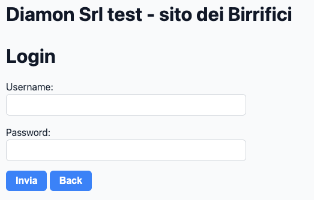
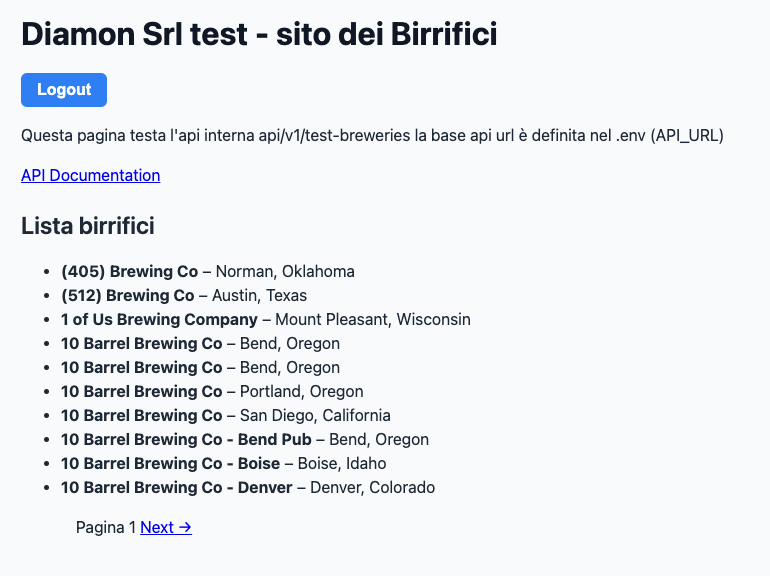
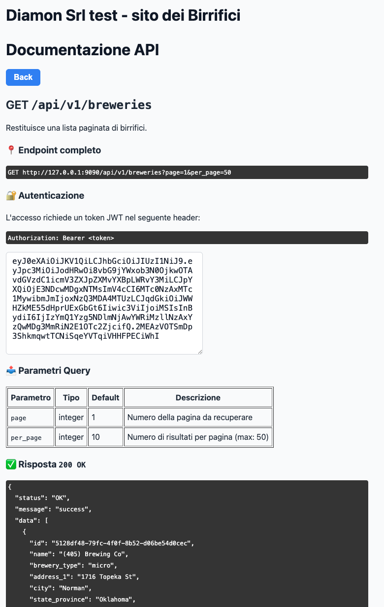

# 🍺 Laravel - Lista Birrifici

Web application Laravel con login predefinito e **API autenticata con JWT** che funge da **proxy verso [OpenBreweryDB](https://www.openbrewerydb.org/documentation/)**. Restituisce una lista paginata di birrifici.

---

## ✨ Caratteristiche principali

- ✅ Login con username e password (`root` / `password`)
- 🔐 Autenticazione tramite JWT
- 🔁 Logout (invalida il token)
- 📡 API versione `v1`: `/api/v1/breweries`
- 📃 Documentazione API interna
- 🌐 Interfaccia web per testare l’API (Blade) con paginazione
- 🐳 Docker + Docker Compose
- 🧪 Test automatici (PHPUnit)
- 🗄️ Database MySQL
- 🧱 Migrazioni Laravel
- 🌱 Seeder per utente `root`
- 🗃️ Accesso phpMyAdmin
- 📦 Risposte API standardizzate

---

## 👤 Credenziali predefinite

| Campo     | Valore     |
|-----------|------------|
| **Username** | `root`     |
| **Password** | `password` |

---

## 🚀 Avvio rapido

1. Clona il repository:
   ```bash
   git clone git@github.com:nicolardi/diamon.git
   cd diamon
   ```

2. Crea il file `.env`:
   ```bash
   cp .env.example .env
   ```

3. Avvia i container Docker:
   ```bash
   docker-compose up --build
   ```

   > Questo comando costruisce l’ambiente, lancia migrazioni e il seeder che crea l’utente `root`.

4. Accedi all’applicazione:
   - Web: [http://localhost:9090](http://localhost:9090)
   - API: `GET http://localhost:9090/api/v1/breweries?page=1&per_page=10` (richiede token JWT)
   - PhpMyAdmin: [http://localhost:9091](http://localhost:9091) (user: `laravel`, password: `secret`)

---

## 🖼️ Screenshot

### 🔐 Login page

http://localhost:9090/login  
Credenziali di test: `root / password`



---

### 📋 Lista birrifici

http://localhost:9090/test-breweries

- Navigazione con pulsanti Next/Previous
- Pulsante per accedere alla documentazione API



---

### 📄 API documentation

http://localhost:9090/test-breweries/api-docs

Include token JWT di esempio (valido 1h) per test su Postman.



---

## ✅ Test automatici

Esegui i test con:

```bash
docker exec -ti laravel_app php artisan test
```

---

## 📦 Standardizzazione risposta API

Le risposte API sono gestite tramite la classe `Helpers\ApiResponse`:

```php
public static function success($data = [], $message = 'success');
public static function error($message = 'Errore', $code = 400);
```

### 🔁 Formato risposta:

```json
{
  "status": "OK|KO",
  "message": "Messaggio descrittivo",
  "data": { ... }
}
```
